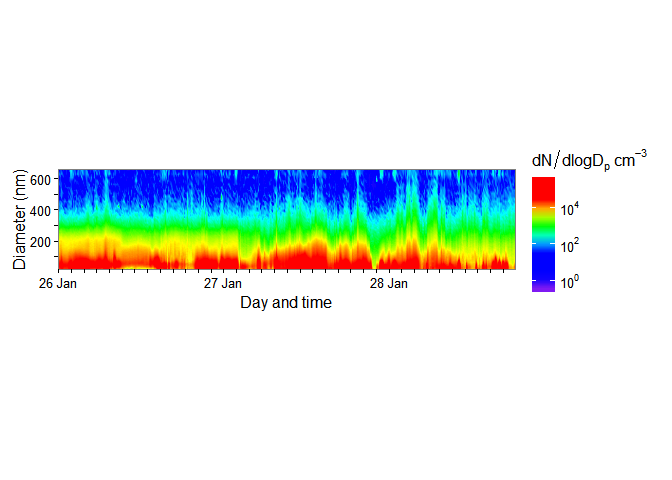
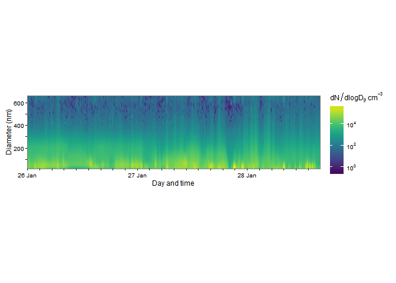
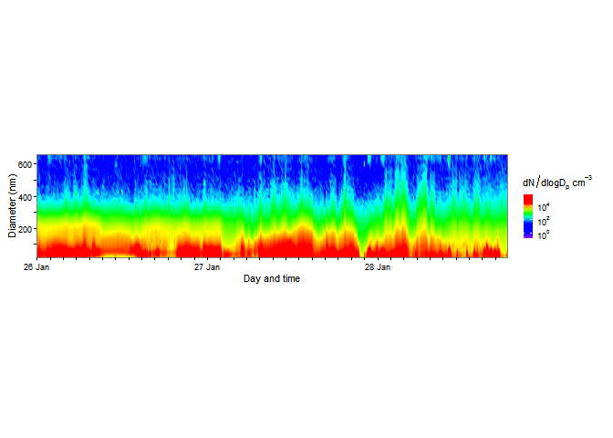

<!-- README.md is generated from README.Rmd. Please edit that file -->
[](https://travis-ci.org/benmarwick/smps)

SMPS
====

Introduction
------------

This package produces time series colour contour plots of data from Scanning Mobility Particle Sizer Spectrometer (SMPS) data. The SMPS is the standard method to measure airborne particle size distributions. The plots that this package produces are widely used for visualising SMPS data in atmospheric science research.

How to install the package
--------------------------

You will need the `devtools` package from CRAN so you can install this package from github with the following line of code:

``` r
# install.packages("devtools")
devtools::install_github("benmarwick/smps")
library(smps)
```

How to use the package
----------------------

First, read your data into R and check that it is in a format that works with this package. You can inspect it to the example dataset that comes with the package like this

``` r
data("my_data")
str(my_data)
head(my_data)
View(my_data)
```

Second, prepare the data using the `prepare_data` function. This converts the variable types and data format into forms suitable for plotting. It also does interpolation of the measured values to give a smooth contour plot. The interpolation can take a minute or two. You can experiment with the interpolation parameters to speed up the operation.

``` r
# prepare the data
prepared_data <- prepare_data(my_data)
#> Update: converting data from wide to long format...
#> Update: wide to long format conversion complete.
#> Update: interpolating the data to give a smooth contour...
#> Update: interpolation complete.
```

Third, plot the data, like so:

``` r
smps_plot(prepared_data)
#> Loading required package: ggplot2
```

<!-- -->

We can also have a log scale on the y-axis:

``` r
smps_plot(prepared_data, y_axis = "log")
#> Loading required package: scales
```

<!-- -->

We can customise a variety of options, including the colour ramp:

``` r
require(viridis)
#> Loading required package: viridis
#> Warning: package 'viridis' was built under R version 3.2.4
smps_plot(prepared_data, 
          font_size = 9, 
          h = '3 hours',
          y_breaks = 100,
          aspect_ratio = 1/4,
          colour_ramp = viridis) 
```

<!-- -->

Because the output is a ggplot object, we can add elements to it like a regular `ggplot()` call:

``` r
smps_plot(prepared_data) + 
  theme(legend.key.size = unit(0.2, "in") )
```

<!-- -->

Please note that this project is released with a [Contributor Code of Conduct](CONDUCT.md). By participating in this project you agree to abide by its terms.
